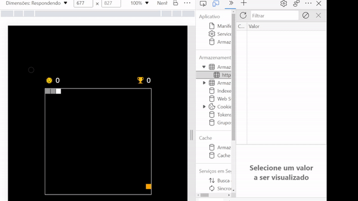
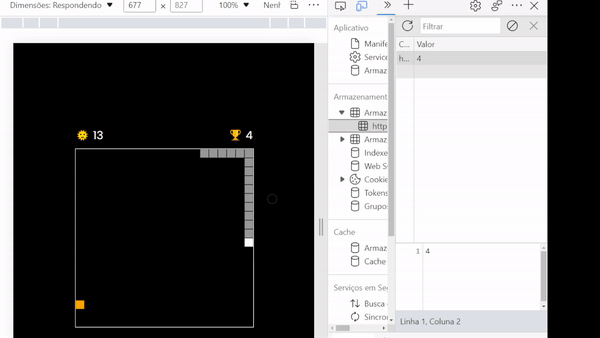

<h1>Snake game v2</h1>
<h1>:us:</h1> 
<h3>Improved version of the first Snake game made with vanilla JS</h3>
This version used the 'canvas' element to create the board instead of regular divs. It shows your current score and your
highest score which is place in your local storage.  

<em>I found this project on Youtube from Code Explained. The credit belongs to them, this was only made for practice purposes. 
Code Explained git : https://github.com/CodeExplainedRepo </em> 

  
  

<h1>&#x1f1e7;&#x1f1f7;</h1>
<h3>Versão melhorada do primeiro Jogo da cobra feito com JavaScript básico</h3>
Essa versão utilizou o elemento 'canvas' ao contrário da primeira que utilizava divs normais. Também mostra seus pontos e o seus pontos máximos
 que ficam guardados no armazenamento local.  

<em>Encontrei esse projeto no Youtube no canal Code Explained. O crédito pertence a eles, este projeto foi feito somente para praticar JS. 
Code Explained git : https://github.com/CodeExplainedRepo </em>
